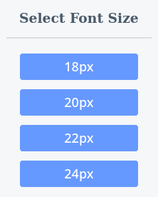

# Font Sizer

A simple browser extension to easily change the current font size of a website. 

<div style="text-align:center"></div>

## Installation

### From Mozilla

The add-on can be installed via [Mozilla's Add-On Page](https://addons.mozilla.org/en-US/firefox/addon/font-sizer/) by clicking on the `+ Add to Firefox` button. 

### From GitHub

In order to install the current (potentially unstable) version of the extension clone this repository:

```bash
git clone https://github.com/Treborium/Font-Sizer-Firefox.git
```

Then in Firefox simply enter `about:debugging` in the url bar and hit enter.
Click on `This Firefox` (only in newer versions) and then click `Load temporary Add-on…` and select any file from the previously cloned repository.  

## Development and Auto Reload

During development it's more convenient to use the command line tool [`web-ext`](https://extensionworkshop.com/documentation/develop/getting-started-with-web-ext/).
The tool can be installed via npm with the following command: 

```bash
npm install -g web-ext
```

The extension can then be tested by using the following command inside the extension folder:

```bash 
web-ext run
```

The `run` command watches your source files and tells firefox to reload the extension whenever they change. A manual reload can be triggered by pressing the `r` key inside the terminal session where `web-ext` is running. 

## Package Extension

In order to package the extension first make sure to **update the version** and then you may run the following command:

```bash
web-ext build
```

The packaged extension can be uploaded to [Mozilla's Developer Hub](https://addons.mozilla.org/en-US/developers/).
